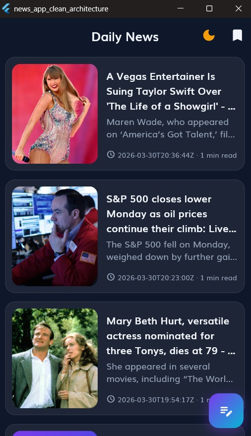
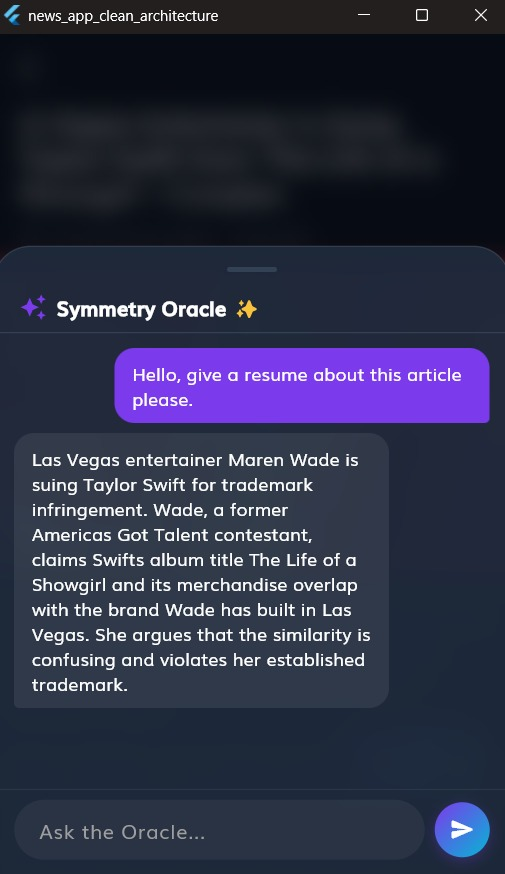
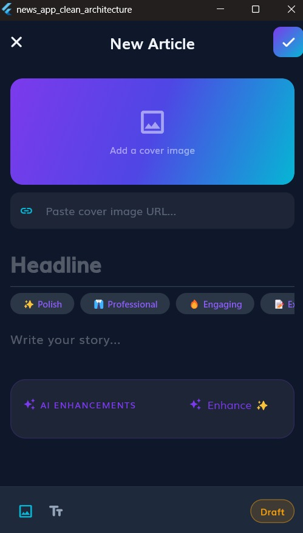
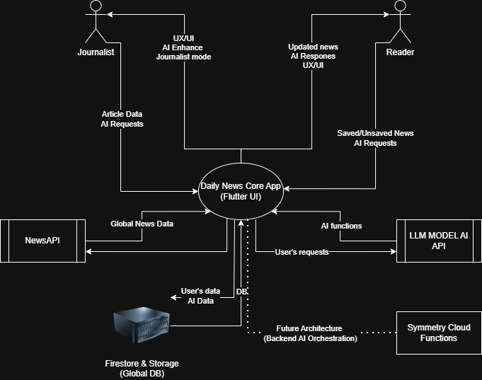
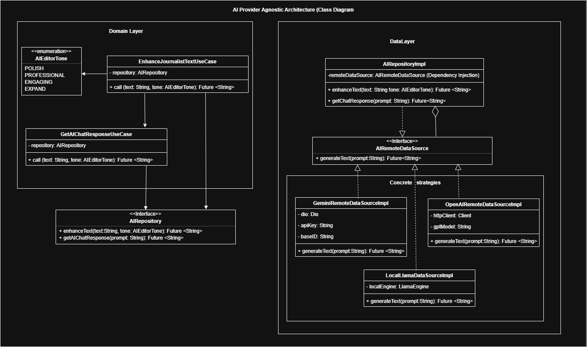

# Applicant Showcase App: Final Report
**Applicant:** Gabriel (Gabo)  
**Role Applied For:** Junior Product Engineer  

---

### 1. Introduction
Stepping into the Applicant Showcase App project as a 5th-semester software engineering student, my initial feelings were a mix of deep excitement and healthy intimidation. The project presented a robust, production-grade tech stack that required a steep learning curve. From day one, my goal was not just to complete a checklist of requirements, but to approach the challenge with a product-centric mindset. I asked myself: *"What if Symmetry suddenly pivoted to become a high-end, exclusive reporting platform?"* This vision guided my architectural and design decisions, transforming a standard technical test into a comprehensive digital news experience that aligns with Symmetry's relentless pursuit of innovation.

### 2. Learning Journey
Before this project, my exposure to certain advanced architectural patterns was limited. I had to rapidly familiarize myself with the unidirectional data flow of Flutter BLoC, the strict layer isolation of Clean Architecture, and the nuances of NoSQL databases. 

The concept that demanded the most intense study was the **Separation of Concerns**. I applied this knowledge by utilizing Dependency Injection, ensuring that my UI components (Cubits/BLoCs) only interacted with abstract `UseCases`. During the final phases, I also learned the intricacies of **Prompt Engineering and REST API integration (Dio)**, successfully connecting Google's Gemini LLM while keeping the AI logic cleanly isolated in the Data Layer without relying on heavy external SDKs.

### 3. Challenges Faced
The most significant obstacle I encountered was a severe framework conflict—a "Dependency Hell" involving version mismatches between code generators (`retrofit_generator` and `floor_generator`) and Dart 3 macros. Taking *Total Accountability* for the product's stability, I overcame this by diving deep into SDK constraints and executing tactical "emergency surgery" on the generated `.g.dart` files. 

During the AI implementation, I faced a "Chat Amnesia" bug where the AI chat history would wipe upon closing the BottomSheet. I solved this by strategically lifting the BLoC state (`AiChatBloc`) up to the Page level using `BlocProvider.value`, ensuring persistent conversational memory. Additionally, I resolved a deprecated endpoint error (404) by migrating the network calls to the highly efficient `gemini-1.5-flash` model.

### 4. Reflection and Future Directions
Technically, this project elevated my understanding of Data Orchestration, Domain Purity, and AI integration. Professionally, it shifted my mindset from a student completing an assignment to a Junior Product Engineer taking ownership of user experience and data integrity. 

Looking forward, the natural evolution of this project is moving the "Bimodular AI" logic into the backend. My primary suggestion for future scaling is migrating the `GeminiRemoteDataSource` calls into **Firebase Cloud Functions** (Node.js/Python). This will centralize the System Prompts, securely hide the API Keys from the client side, and allow for robust Rate Limiting and Token Management for millions of users.

### 5. Proof of the Project
*(Note for the reviewer: Click the links below to view the application in action. The video now includes the Symmetry Oracle and Pro Editor AI features).*

* **[Link to Video Demo: Full App Sustentation, Emulators & AI Features](https://youtu.be/ksl1SKPFxgw)**
* **Screenshot 1:** Dark Mode Feed
  * 
* **Screenshot 2:** Newspaper Mode Feed
  * 
* **Screenshot 3:** The Symmetry Oracle (Ask AI)
  * 
* **Screenshot 4:** Symmetry Pro Editor (AI Action Chips)
  * 

### 6. Overdelivery
To embody the core value to *Maximally Overdeliver*, I pushed the application beyond the initial requirements, categorizing my enhancements into two main pillars:

#### Pillar 1: Core Product & UX Engineering
* **The Newspaper Mode (Generational UX):** To solve the UI paradox of designing for a 90-year-old grandmother and an 18-year-old NPC, I created a highly accessible, dynamic theme. The Newspaper Mode uses strict Serif typography and applies a grayscale matrix filter to the images in the main feed to reduce cognitive load and emulate the broadsheet legacy, without losing the modern feel.
* **Unified Feed via Data Orchestration:** Instead of isolating the external NewsAPI and the internal Firebase feeds, I built a `GetUnifiedArticlesUseCase`. It fetches both data streams, merges them, maps them to a single domain entity, and sorts them chronologically for a seamless scrolling experience.
* **Symmetry Exclusive Tagging & Core Editor:** I added an `isExclusive` boolean field to the Firestore schema, visually highlighting internal journalist articles with a "SYMMETRY EXCLUSIVE ⚡" badge. Additionally, the pro editor includes live word counters, shimmer loading effects, and fluid 60fps staggered animations.

#### Pillar 2: The Bimodular AI Ecosystem
* **Phase 5 - The Symmetry Oracle (Consumer AI):** I built a fully functional, context-aware AI assistant integrated into the Article Detail View. Using a strict "Truth is King" Grounding Protocol, the Oracle answers questions, translates, and summarizes *only* using the article's text, politely declining out-of-scope questions to prevent hallucinations.
* **Phase 6 - Symmetry Pro Editor (Creator AI):** I implemented "Samsung Galaxy AI" style inline text-editing superpowers for the Journalist. By utilizing interactive Action Chips (`[✨ Polish]`, `[👔 Professional]`, `[🔥 Engaging]`), the editor dynamically rewrites the journalist's text in-place using programmatic `TextEditingController` manipulation, ensuring the cursor remains perfectly positioned for a seamless writing experience.

#### Prototypes Created:
* **System Context Diagram (Cross-Platform Vision):** I designed a C4 Context Diagram in UML to prototype the future transition into a fully unified cross-platform ecosystem where the Flutter Client securely interacts with a Firebase Backend.
  * 
* **Domain Class Diagram (AI Provider Agnostic):** To prepare for future LLM iterations, I created a UML Class Diagram prototyping an `AiProviderStrategy` pattern, ensuring the app is not hardcoupled to a single AI provider.
  * 
* **Engineering Scalability Roadmap:** I drafted a strategic engineering roadmap to detail how the "Bimodular AI" features and Cross-Platform targets will be orchestrated in Phase 7 and beyond.
  * [🚀 View the Comprehensive Project Roadmap](../frontend/docs/future_architecture/roadmap.md)

#### How Can You Improve This:
While the current features demonstrate rapid prototyping capabilities, the next evolution requires decoupling the AI business logic from the Flutter frontend and moving it to a **Firebase Cloud Functions Microservice** architecture. Additionally, integrating a vector database (like Algolia or ElasticSearch) would transform the static news feed into a semantics-searchable global intelligence platform.

### 7. Architectural Trade-offs & Environments
To maintain transparency and align with Symmetry's *Truth is King* value, here are the technical trade-offs made during development:

* **AI Orchestration (Frontend vs Backend):** For this 72-hour prototype, the Gemini LLM orchestration is handled in the client's Data Layer (`GeminiRemoteDataSource`). This bypasses the need for a paid Firebase Blaze plan (required for Cloud Functions). In production, this must be migrated to the backend to protect API secrets.
* **Supported Environments:** This project has been heavily tested and optimized for **Windows Desktop** and Android Emulators. 
  * *Mobile:* Native Firebase configuration files (`google-services.json`) are excluded from Git for security. Reviewers must provide their own credentials to compile for native mobile.
  * *Web:* Running on Flutter Web is not recommended for this review due to strict browser CORS policies that will block the external REST API calls to the AI models. 
  * *Recommendation:* Please evaluate the app using `flutter run -d windows` (or macOS/Linux desktop) for the most stable and intended experience.
